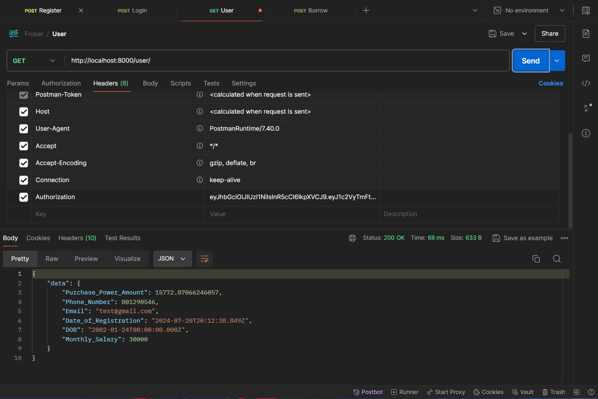

# Froker

It is backend for the a money lending platform.

## Installation

Use the package manager [npm](https://www.npmjs.com/) to install dependencies.

```bash
npm install
```

## Run
```bash
nodemon server.js
```

## Signup - /signup
1. User signup into the platform using all the correct details

2. User who is below 20 years of age

3. User who has a salary of less than 25k

4. Already registered user

5. If user by mistakenly enter an invalid email


## Login - /login
1. User login into the platform using all the correct details

2. If user by mistakenly enters an invalid email

3. If user by mistakenly enters a wrong password

4. If unregistered user tries to login


## Get user - /user
1. Authenticated user tries to access his/her details

2. If user pass in a wrong token or if an unauthenticated person tries to access the data

3. If token not found


## Borrow - /borrow
1. Authenticated and eligible user tries to borrow

2. Non eligible person tries to borrow

3. If token not found
